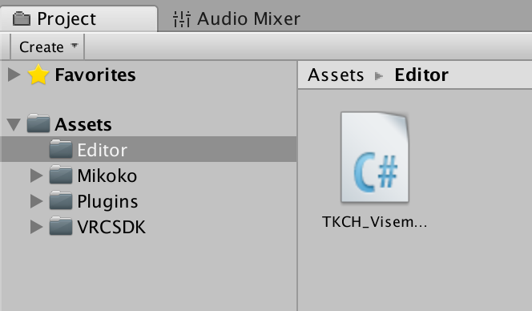
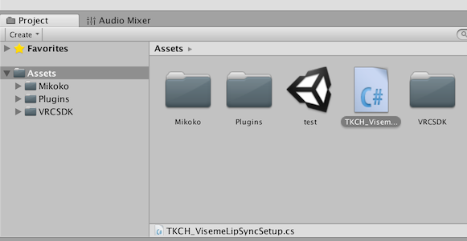
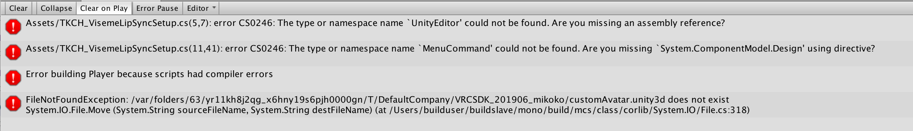

# vrcsdkVisemeLipSyncSetup

Unity の Editor 拡張

## Description

VRChat用カスタムアバターとしてアップロードするモデルに Lip Sync を設定する作業を自動化します。 

TKCH_VisemeLipSyncSetup.cs を Assets フォルダの下の Editor サブフォルダに配置します。（Editor サブフォルダがない場合は作成してください） 

Assets フォルダ直下に配置すると、アバターアップロード時にエラーになります。

アバターアップロード時にエラーになった場合、Editor サブフォルダのスペルミスやAssets フォルダ直下に配置していないかを確認してください。

ヒエラルキーにモデルを配置し、VRC_AvatarDescriptorコンポーネントを追加したら、 
Inspectorウィンドウの歯車アイコンから VisemeLipSyncSetup を実行すると、 
「Face」、「Body」、その他の順で Lip Sync 対応オブジェクトを検索し、自動で設定します。 

動作確認した環境
- Unity 2017.4.28f1
- VRCSDK-2019.06.19.20.14

動作確認したモデル
- Mikoko （ https://nekomasu.wixsite.com/kemomimioukoku/mikoko ）
- Nekoma （ https://nekomasu.wixsite.com/kemomimioukoku/nekoma ）

## Author

github:[eijis](https://github.com/eijis-pan)  または twitter: @ eijis_pan

## Disclaimer

利用は自己責任でお願いします。 
本プログラムは、なんの欠陥もないという無制限の保証を行うものではありません。 
本プログラムに関する不具合修正や質問についてのお問い合わせもお受けできない場合があります。 
本プログラムの利用によって生じたあらゆる損害に対して、一切の責任を負いません。 
本プログラムの利用によって生じるいかなる問題についても、その責を負いません。
